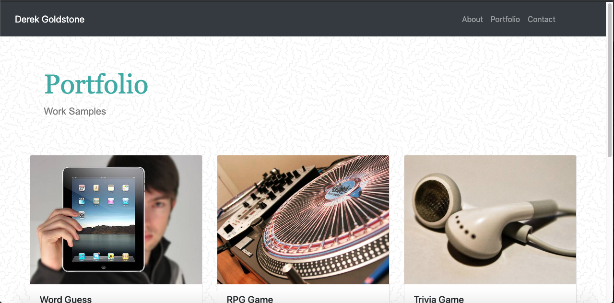

# Bootstrap-Portfolio

___

The Bootstrap-Portfolio assignment involved recreating the basic portfolio formatting with bootstrap formatting. This particular webpage made use of Bootstrap's navbar, jumbotron, card deck, and form featured layouts. The grid system was utilized via column sizing in order to create a responsive layout. All images displayed on the index and portfolio pages make use of responsive images via bootstrap's img-fluid feature.  

## Built With

___

* HTML
* CSS
* Bootstrap

___

